<div align="center">


</div>

<br>

<table align="center">
<tr>
<td>

```yaml
whoami:
  name: "Ridho Putra Aulia"
  alias: "Emonn"
  handle: "@RidhoPtraDev"
  role: "Full-Stack Developer"
  building:
    - "MindCare — mental health platform with an AI assistant"
  learning: "TypeScript · Next.js · NestJS"
  status: "learning in public, shipping consistently"
```

</td>
</tr>
</table>

<br>

<div align="center">

</div>

Hi, I'm **Ridho Putra Aulia**, but most people call me **Emonn**. I build full-stack web applications, from the interface people see to the backend and database behind it.

I enjoy products that make a real difference. My main project right now is **[MindCare](https://github.com/RidhoPtraDev/MindCare)**, a mental health platform with an AI assistant, chat and video consultations with psychologists, and a Mood Journey feature for tracking and reflecting on your moods.

- Building: **MindCare**
- Working with: **TypeScript, Next.js, NestJS, PostgreSQL**

<br>

<div align="center">


<br>


</div>

<br>

<div align="center">

</div>

| Project | What it is | Stack |
|---|---|---|
| [**MindCare**](https://github.com/RidhoPtraDev/MindCare) | Mental health platform with an AI assistant, chat/video consultations with psychologists, and Mood Journey | Full-stack web |
| [**learning-space**](https://github.com/RidhoPtraDev/learning-space) | PemWeb (web programming) project | JavaScript |

<br>

<div align="center">


<br>



<sub>Kartu di atas statis (bukan live), karena layanan gratis pihak ketiga yang biasa dipakai sering down. Update manual kapan-kapan, atau ganti balik ke link live kalau layanannya sudah pulih.</sub>
</div>

<div align="center">

</div>

<br>

<div align="center">


<br>

[](https://github.com/RidhoPtraDev)
<!-- Aktifkan kalau sudah punya, ganti isinya:
[](https://linkedin.com/in/USERNAME_LINKEDIN)
[](mailto:EMAIL_KAMU@gmail.com)
-->

<br>


<br><br>


</div>
